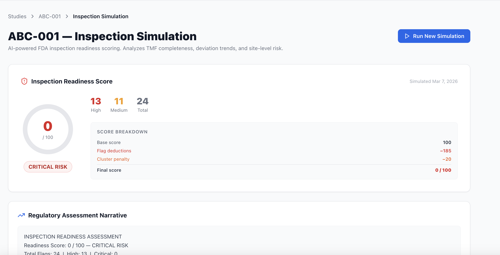
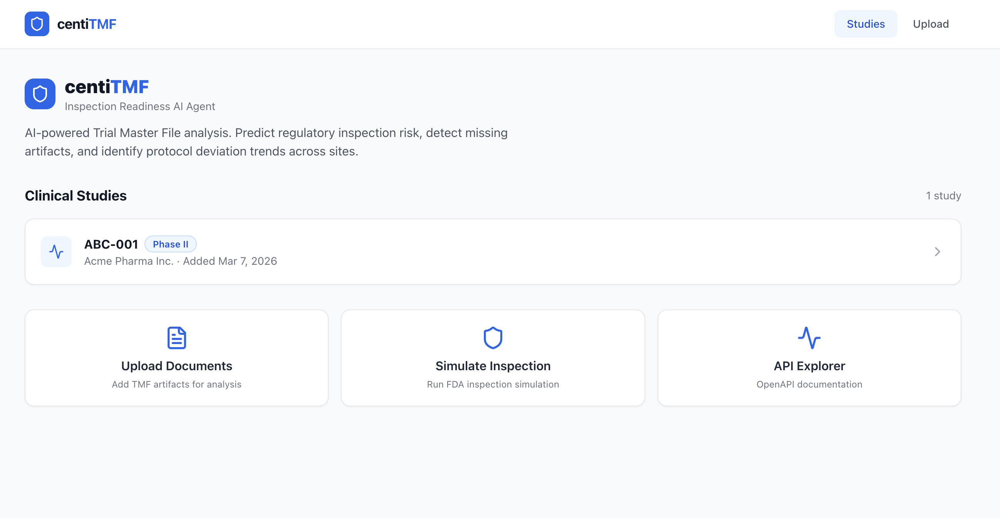
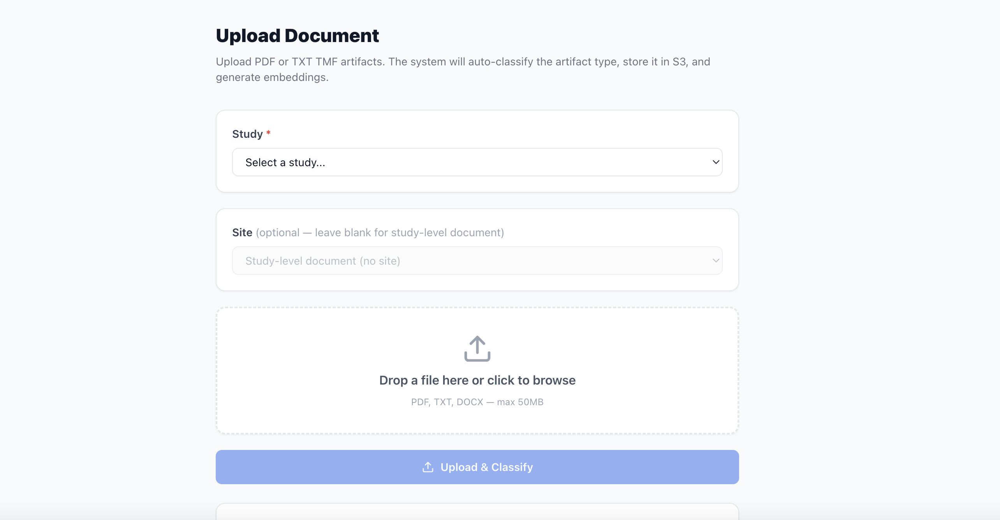

# centiTMF

AI-native compliance intelligence for clinical trials.

**Live application:** [centi-tmf-agent.vercel.app](https://centi-tmf-agent.vercel.app/)

centiTMF helps clinical teams maintain inspection readiness, monitor document completeness, detect TMF compliance gaps, and prepare for audits and regulatory review.

---

## Why centiTMF

Clinical trials depend on a complete and inspection-ready Trial Master File (TMF), but maintaining readiness is often manual, reactive, and difficult to monitor across sites.

centiTMF adds a compliance intelligence layer that continuously answers:

> "If auditors or regulators reviewed this study next month, where would we be exposed?"

The platform analyzes TMF artifacts and site-level activity to surface risk before it becomes a real inspection problem.

---

## Core Capabilities

- **eTMF Health Dashboard** — at-a-glance Completeness / Timeliness / Quality / Risk metrics with recommended actions
- **Inspection Readiness Monitoring** — 0–100 readiness score with zone classification (LOW / MEDIUM / HIGH / CRITICAL)
- **AI Auto-Classification + Manual Override** — AI classifies uploaded documents; users can review and override the classification before filing
- **Document Completeness Analysis** — automated detection of missing TMF artifacts per site
- **Missing Artifact Detection** — data-driven compliance rules evaluated against a normalized fact model
- **Protocol Deviation Intelligence** — cross-document analysis detecting deviation trends and risk signals per site
- **Site-Level Risk Visibility** — per-site flag counts, deviation scores, and enrollment-gated compliance checks
- **Inspection Simulation** — run from the homepage hero or study dashboard; produces composite score, penalty breakdown, and AI narrative
- **Audit Questions** — ask bounded natural-language questions grounded in study compliance data

---

## Screenshots

### Study List

*The home screen shows all clinical studies with one-click access to each study's compliance dashboard.*

### Study Dashboard — Inspection Readiness

*The study dashboard surfaces inspection readiness at a glance: flag counts, site-level risk rankings, and deviation signals.*

### Inspection Simulation

*Simulation generates a 0–100 readiness score with a full penalty breakdown, AI narrative, and site deviation risk chart.*

---

## Architecture Overview

```
Document Upload  ──►  AI Classifier (+ confidence)  ──►  Manual Override (optional)
                                                                │
                                                      S3 / PostgreSQL
                                                                │
                                                  eTMF Dashboard Aggregation
                                                  (Completeness · Timeliness · Quality)
                                                                │
                                                     Compliance Engine
                                                     (Fact Model + Rules)
                                                                │
                                                     Deviation Intelligence
                                                     (Text Pattern Scoring)
                                                                │
                                                     Inspection Simulation
                                                     (Base-100 Scoring + LLM)
                                                                │
                                                  Audit Questions ──►  Report
```

1. **Document Ingestion** — PDF/TXT upload, rule-based artifact classification with confidence scoring, full-text extraction, signature detection, vector embedding
2. **Classification Override** — AI classification is preserved as `detected_artifact_type`; user overrides update `artifact_type` and set `classification_overridden = true` for audit trail
3. **eTMF Dashboard** — aggregates documents, flags, and simulation results into Completeness / Timeliness / Quality / Risk / Audit-Readiness metrics
4. **Fact Model Generation** — `FactBuilder` normalizes each site's state into a deterministic fact dict
5. **Rule-Based Compliance Detection** — 10 data-driven JSON rules evaluated against the fact model; violations become compliance flags
6. **Deviation Intelligence** — keyword pattern scoring across site documents detects protocol deviation signals
7. **Scoring and Simulation** — base-100 subtract model with CRITICAL/HIGH/MEDIUM/LOW deductions and cluster/deviation penalties
8. **Audit Questions** — bounded Q&A grounded in flags, deviation signals, and simulation outputs; enhanced by GPT-4o when configured

---

## Structured Compliance Model

centiTMF converts raw TMF artifacts and trial activity into a normalized fact model that drives rule evaluation, scoring, simulation, and audit reasoning.

For each site in a study, `FactBuilder` produces a deterministic, structured fact dict:

```json
{
  "study_id": "ABC-001",
  "site_id": "012",
  "site_activated": true,
  "patients_enrolled": 22,
  "has_current_1572": false,
  "delegation_log_current": false,
  "monitoring_report_late": true,
  "deviation_signal_score": 72
}
```

These structured facts are:

- **Evaluated against rule definitions** — JSON-defined compliance rules specify conditions on fact fields; violations become typed flags (CRITICAL / HIGH / MEDIUM / LOW)
- **Aggregated into a risk score** — the scoring model deducts from a base of 100 based on flag severity, site clustering, and deviation signal thresholds
- **Used to ground audit answers** — the audit Q&A layer reads the same facts, flags, and deviation signals rather than relying on free-form generation
- **Stored for historical comparison** — each simulation persists a `results_json` snapshot alongside the score, enabling inspection-over-time tracking

This design keeps the reasoning explainable: every penalty, flag, and audit answer can be traced to a named fact and a named rule.

---

## Tech Stack

| Layer | Technology |
|-------|-----------|
| Backend | FastAPI, Python 3.11, SQLAlchemy 2.0 (async), Pydantic v2 |
| Database | PostgreSQL 16 + pgvector (Supabase in production) |
| Storage | Cloudflare R2 (production) · MinIO S3-compatible (local dev) |
| Frontend | Next.js 14, TypeScript, TailwindCSS (App Router) |
| Embeddings | OpenAI text-embedding-3-small (deterministic hash fallback) |
| LLM | GPT-4o (deterministic template fallback) |
| Infrastructure | Docker Compose (local) · Vercel + Render (production) |

---

## Local Setup

**Prerequisites:** [Docker Desktop](https://www.docker.com/products/docker-desktop/)

```bash
# 1. Clone the repository
git clone https://github.com/TechAviator200/centiTMF-agent.git
cd centiTMF

# 2. (Optional) Configure OpenAI for AI-enhanced narratives and audit answers
cp .env.example .env
# Edit .env and set OPENAI_API_KEY=sk-...

# 3. Start all services
docker compose up --build
```

Services:

| Service | URL |
|---------|-----|
| Frontend | http://localhost:3000 |
| Backend API | http://localhost:8000 |
| API Docs (Swagger) | http://localhost:8000/docs |
| MinIO Console (local only) | http://localhost:9001 |

On first start, the backend automatically seeds demo study **ABC-001** with three sites and representative TMF documents.

---

## Demo

See [docs/demo-walkthrough.md](docs/demo-walkthrough.md) for a guided 3-minute walkthrough.

---

## Running Tests

```bash
# Inside Docker
docker compose exec backend pytest

# Or locally (Python 3.11 + dev dependencies)
cd backend && pip install -e ".[dev]" && pytest
```

Tests cover the rule engine evaluator, artifact classifier, and risk scoring model. All tests are pure unit tests — no database required.

---

## Make Commands

```bash
make up            # Build and start all services
make down          # Stop all services
make logs          # Stream all service logs
make logs-backend  # Stream backend logs only
make shell-backend # Open a shell in the backend container
make shell-db      # Open psql in the postgres container
make seed          # Re-run the seed script
make reset         # Wipe volumes and rebuild from scratch
```

---

## Documentation

| Document | Description |
|----------|-------------|
| [docs/PRD.md](docs/PRD.md) | Product requirements and roadmap |
| [docs/architecture.md](docs/architecture.md) | System design and data flow |
| [docs/rule-engine.md](docs/rule-engine.md) | Fact model and compliance rule evaluation |
| [docs/demo-walkthrough.md](docs/demo-walkthrough.md) | Step-by-step demo guide |
| [docs/api-overview.md](docs/api-overview.md) | REST API reference |

---

## Cloud Deployment

centiTMF is designed to run on:

| Layer | Local | Production |
|-------|-------|-----------|
| Frontend | Docker (`localhost:3000`) | Vercel |
| Backend | Docker (`localhost:8000`) | Render |
| Database | Docker Postgres | Supabase |
| Storage | Docker MinIO | Cloudflare R2 |

### Backend on Render

1. Create a new **Web Service** on Render and point it at the repo root.
2. Set **Dockerfile path** to `./backend/Dockerfile` and **Docker context** to `./backend`.
3. Add the environment variables below in the Render dashboard.
4. Render sets `$PORT` automatically — the backend reads it at startup.

**Required backend env vars (Render):**

| Variable | Value |
|----------|-------|
| `DATABASE_URL` | Supabase pooled connection string (`postgresql://...`) |
| `SYNC_DATABASE_URL` | Supabase direct connection string (optional — derived from `DATABASE_URL` if omitted) |
| `S3_ENDPOINT_URL` | `https://<account-id>.r2.cloudflarestorage.com` |
| `S3_ACCESS_KEY` | Cloudflare R2 Access Key ID |
| `S3_SECRET_KEY` | Cloudflare R2 Secret Access Key |
| `S3_BUCKET` | R2 bucket name (must be pre-created in Cloudflare dashboard) |
| `AWS_REGION` | `auto` |
| `OPENAI_API_KEY` | Optional — enables GPT-4o narrative |

### Frontend on Vercel

1. Import the repo into Vercel and set **Root Directory** to `frontend`.
2. Add the environment variables below in the Vercel dashboard.

**Required frontend env vars (Vercel):**

| Variable | Value |
|----------|-------|
| `NEXT_PUBLIC_API_URL` | Your Render backend URL, e.g. `https://centitmf-backend.onrender.com` |
| `INTERNAL_API_URL` | Same Render backend URL (used for server-side rendering) |

### Supabase Database Notes

- Use the **Session Mode pooler** URL (port 6543) for `DATABASE_URL`.
- Leave `SYNC_DATABASE_URL` **blank** — it will be derived automatically from `DATABASE_URL`.
- **Do not** use the direct host (`db.[ref].supabase.co:5432`) for Render deployments — it is IPv6-only and unreachable from Render's IPv4 network.
- Both `postgres://` and `postgresql://` URL schemes are accepted and normalized automatically.

### Cloudflare R2 Notes

- Create your R2 bucket in the Cloudflare dashboard before deploying.
- Set `AWS_REGION=auto` — R2 does not use AWS regions.
- R2 is S3-compatible; no code changes are required beyond setting the endpoint and credentials.

---

## Environment Variables

See [.env.example](.env.example) for the full reference with comments.

| Variable | Local default | Description |
|----------|--------------|-------------|
| `OPENAI_API_KEY` | *(empty)* | Optional AI enhancement |
| `DATABASE_URL` | Docker Postgres | Async DB URL for FastAPI |
| `SYNC_DATABASE_URL` | Derived from `DATABASE_URL` | Sync DB URL for seed script |
| `S3_ENDPOINT_URL` | `http://minio:9000` | Storage endpoint (MinIO or R2) |
| `S3_ACCESS_KEY` | `centitmf` | Storage access key |
| `S3_SECRET_KEY` | `centitmf123` | Storage secret |
| `S3_BUCKET` | `centitmf-docs` | Bucket name |
| `AWS_REGION` | `auto` | Region (`auto` for R2) |
| `NEXT_PUBLIC_API_URL` | `http://localhost:8000` | Backend URL for browser |
| `INTERNAL_API_URL` | `http://backend:8000` | Backend URL for SSR |

---

## License

MIT
